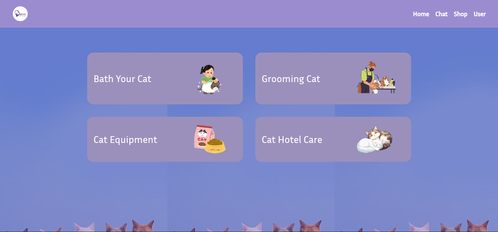
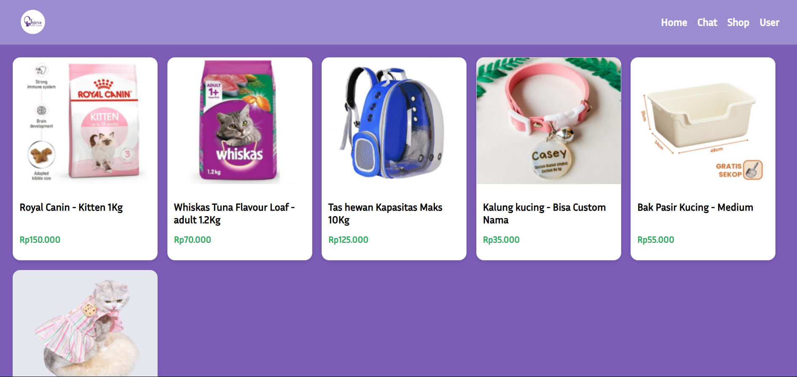
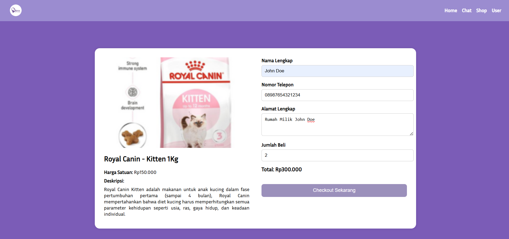
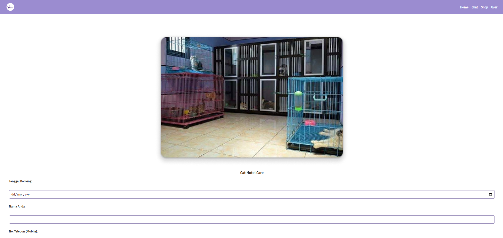
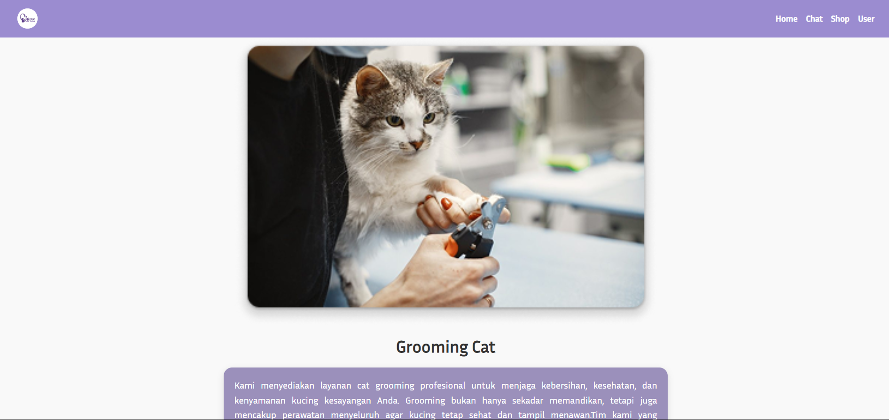
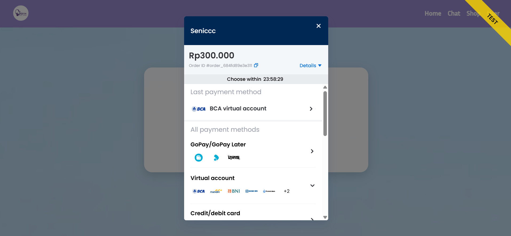
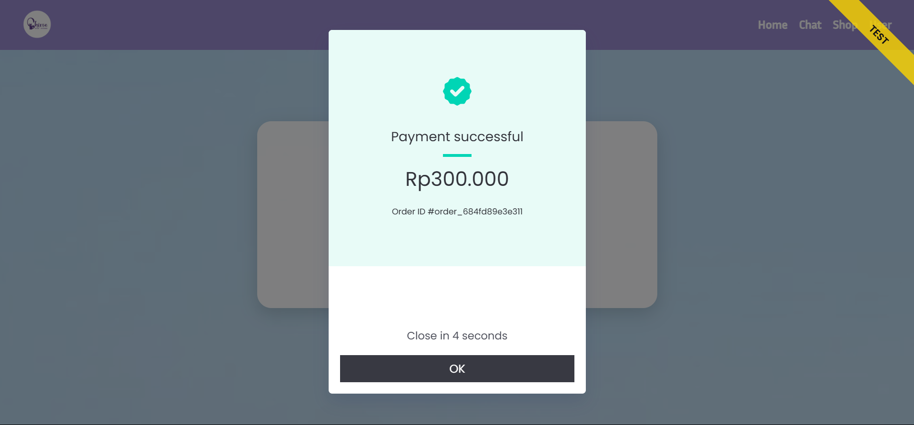
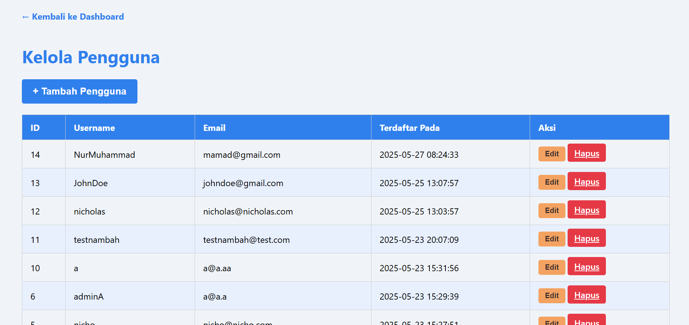
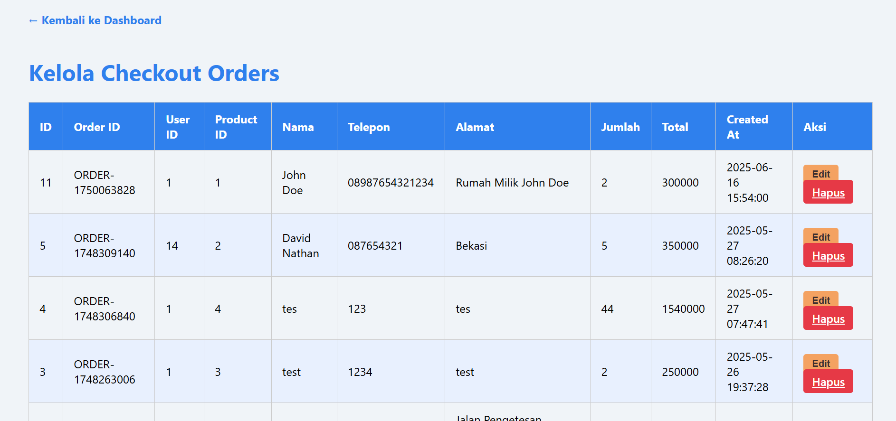

# Shiroo Pet Store Web App

A simple web application built with HTML, CSS, PHP, and MySQL. Users can browse pet products, book grooming or cat hotel services, and make payments using Midtrans Snap API. Admins can manage users, products, bookings, and orders.

## 🔧 Features
- User registration & login
- Product catalog & detail
- Service booking (grooming, bath, cat hotel)
- Midtrans payment integration
- Admin panel for managing users, products, bookings, and orders

## 🖼️ Screenshots
- 
- 
- 
- 
- 
- 
- 
- 
- 
- 

